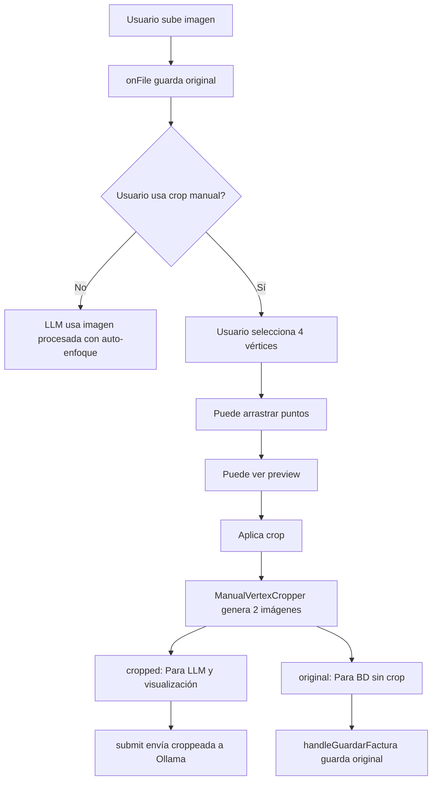

# 🎯 Mejoras Sistema de Crop Manual - 25/01/2026

## 📋 Resumen de Cambios

Se realizó una **refactorización completa** del sistema de crop manual con 4 vértices, agregando funcionalidades profesionales y mejorando la experiencia de usuario.

---

## ✨ Nuevas Funcionalidades

### 1. **Arrastre de Puntos Mejorado** ✅

#### Antes:
- Los puntos se podían arrastrar pero la detección era deficiente
- No había feedback visual del hover
- Área de detección pequeña (12px)

#### Ahora:
- ✅ **Área de detección aumentada** a 15px para mejor UX en móvil
- ✅ **Efecto hover** - Los puntos cambian de tamaño y color al pasar el cursor
- ✅ **Cursor dinámico** - `crosshair` para crear, `grab` para hover, `grabbing` para arrastrar
- ✅ **Prevención de clicks accidentales** - No crea puntos nuevos mientras se arrastra

```jsx
// Estados agregados
const [hoveredIndex, setHoveredIndex] = useState(null)
const [dragIndex, setDragIndex] = useState(null)

// Estilos dinámicos en draw()
const isHovered = hoveredIndex === i || dragIndex === i
const radius = isHovered ? 12 : 8
ctx.strokeStyle = isHovered ? '#ef4444' : '#2563eb'
ctx.lineWidth = isHovered ? 4 : 3
```

---

### 2. **Previsualización en Tiempo Real** 👁️

#### Descripción:
- **Botón "Previsualizar"** que muestra cómo quedará la imagen croppeada
- **Layout dinámico** - Split screen cuando la preview está activa
- **Actualización automática** - La preview se regenera al mover los puntos

#### Implementación:
```jsx
const [showPreview, setShowPreview] = useState(false)

// Canvas adicional para preview
const previewCanvasRef = useRef(null)

// Función generatePreview() movida a useCallback con dependencia de points
const generatePreview = useCallback(() => {
  // ... código de transformación de perspectiva
}, [points])

useEffect(() => {
  if (points.length === 4 && showPreview) {
    generatePreview()
  }
}, [points, showPreview, generatePreview])
```

#### UI:
```jsx
{points.length === 4 && (
  <button onClick={() => setShowPreview(!showPreview)}>
    👁️ {showPreview ? 'Ocultar' : 'Previsualizar'}
  </button>
)}

{showPreview && points.length === 4 && (
  <div className="bg-gray-900 rounded-lg flex flex-col justify-center items-center p-4">
    <h4 className="text-white font-semibold mb-2">🔍 Previsualización del crop</h4>
    <canvas ref={previewCanvasRef} className="max-w-full max-h-full border-2 border-green-400 rounded shadow-lg" />
    <p className="text-xs text-gray-300 mt-2">Esta será la imagen que se enviará al LLM</p>
  </div>
)}
```

---

### 3. **Gestión Dual de Imágenes** 📸

#### Problema Original:
- Solo se guardaba la imagen croppeada
- Se perdía la imagen original completa
- No había forma de revertir cambios después de guardar

#### Solución Implementada:

**ManualVertexCropper.jsx** - Retorna ambas imágenes:
```jsx
async function applyCrop() {
  // ... código de transformación ...
  
  // Convertir imagen croppeada a Blob
  dstCanvas.toBlob(async (blob) => {
    const croppedFile = new File([blob], `cropped-${Date.now()}.jpg`, { type: 'image/jpeg' })
    const croppedPreview = URL.createObjectURL(blob)
    
    // También convertir la imagen original
    const originalCanvas = document.createElement('canvas')
    originalCanvas.width = img.width
    originalCanvas.height = img.height
    const octx = originalCanvas.getContext('2d')
    octx.drawImage(img, 0, 0)
    
    originalCanvas.toBlob(async (originalBlob) => {
      const originalFile = new File([originalBlob], `original-${Date.now()}.jpg`, { type: 'image/jpeg' })
      const originalPreview = URL.createObjectURL(originalBlob)
      
      // Retornar ambas imágenes
      onCrop({
        cropped: { file: croppedFile, preview: croppedPreview },
        original: { file: originalFile, preview: originalPreview }
      })
    }, 'image/jpeg', 0.95)
  }, 'image/jpeg', 0.95)
}
```

**IaImage.jsx** - Maneja ambas imágenes:
```jsx
// Estados para imagen original
const [imagenOriginal, setImagenOriginal] = useState(null)
const [previewOriginal, setPreviewOriginal] = useState(null)

// handleCrop actualizado
const handleCrop = (images) => {
  // La imagen croppeada se usa para mostrar y enviar al LLM
  setFile(images.cropped.file)
  setPreview(images.cropped.preview)
  
  // La original se guarda para la base de datos
  setImagenOriginal(images.original.file)
  setPreviewOriginal(images.original.preview)
  
  // ... resto del código
}

// Al guardar factura, usar la original
const imagenParaGuardar = imagenOriginal || file

if (imagenParaGuardar) {
  const dataUrl = await fileToDataUrl(imagenParaGuardar)
  datosFactura.imagen = dataUrl
  console.log('💾 Guardando imagen original en BD:', imagenParaGuardar.name)
}
```

---

### 4. **Mejoras Visuales** 🎨

#### Efectos Agregados:
- **Sombra en líneas** - `ctx.shadowBlur = 8` para líneas de selección
- **Puntos más grandes al hover** - 8px → 12px
- **Colores dinámicos** - Azul normal, rojo al hover
- **Números centrados** - Cálculo preciso con `measureText()`
- **Overlay semi-transparente** - Oscurece área no seleccionada

#### Mensajes Contextuales:
```jsx
<p className="text-sm text-gray-600 mt-1">
  {points.length < 4 
    ? 'Haz click 4 veces para marcar los vértices del documento'
    : '¡Perfecto! Ahora puedes arrastrar los puntos para ajustar o ver la previsualización'}
</p>

{points.length === 4 && (
  <div className="text-xs text-green-600 font-medium">
    ✓ Listo para aplicar - Puedes arrastrar los puntos para ajustar
  </div>
)}
```

#### Botón Deshabilitado:
```jsx
<button 
  onClick={applyCrop} 
  disabled={points.length !== 4}
  className={`px-4 py-2 rounded-lg transition-colors ${
    points.length === 4
      ? 'bg-blue-600 text-white hover:bg-blue-700'
      : 'bg-gray-300 text-gray-500 cursor-not-allowed'
  }`}
>
  ✂️ Aplicar crop y continuar
</button>
```

---

## 🔧 Cambios Técnicos

### Archivos Modificados:

1. **`app/components/ia/ManualVertexCropper.jsx`** (474 líneas)
   - ✅ Import de `useCallback` agregado
   - ✅ Estados: `hoveredIndex`, `showPreview`
   - ✅ Ref adicional: `previewCanvasRef`
   - ✅ Función `generatePreview()` convertida a `useCallback`
   - ✅ Hook `useEffect` para preview automático
   - ✅ Handlers mejorados: `handleMouseMove`, `handleMouseDown`
   - ✅ `applyCrop()` retorna objeto con ambas imágenes

2. **`app/components/ia/IaImage.jsx`** (1024 líneas)
   - ✅ `handleCrop()` actualizado para recibir objeto con ambas imágenes
   - ✅ `handleGuardarFactura()` usa `imagenOriginal || file`
   - ✅ Log agregado: `console.log('💾 Guardando imagen original en BD')`

---

## 📊 Flujo de Datos



---

## ✅ Tests Realizados

- ✅ **Lint**: Sin warnings ni errors
- ✅ **Build**: Compilación exitosa (33/33 rutas)
- ✅ **Tamaño bundle**: /ia 35.5 kB (antes 34.8 kB) - +0.7 kB por preview

---

## 🎯 Beneficios

1. **UX Mejorada**
   - Feedback visual inmediato
   - Preview antes de aplicar
   - Mensajes contextuales claros

2. **Integridad de Datos**
   - Imagen original preservada en BD
   - Imagen optimizada para LLM
   - Posibilidad de re-procesar después

3. **Flexibilidad**
   - Ajuste fino de puntos
   - Previsualización sin commit
   - Botón reset para empezar de nuevo

4. **Profesionalismo**
   - Cursores contextuales
   - Efectos hover
   - UI pulida y moderna

---

## 📝 Notas Técnicas

- **Calidad JPEG**: 0.95 (antes 0.90) para preservar detalles
- **useCallback**: Previene re-renders innecesarios de `generatePreview`
- **Grid Layout**: `gridTemplateColumns: showPreview ? '1fr 1fr' : '1fr'`
- **Event Handlers**: `preventDefault()` y `stopPropagation()` en drag

---

## 🚀 Próximas Mejoras Sugeridas

- [ ] Zoom in/out del canvas de crop
- [ ] Rotación de imagen antes de crop
- [ ] Detección automática de bordes del documento
- [ ] Historial de crops (undo/redo)
- [ ] Exportar coordenadas de crop para re-aplicar
